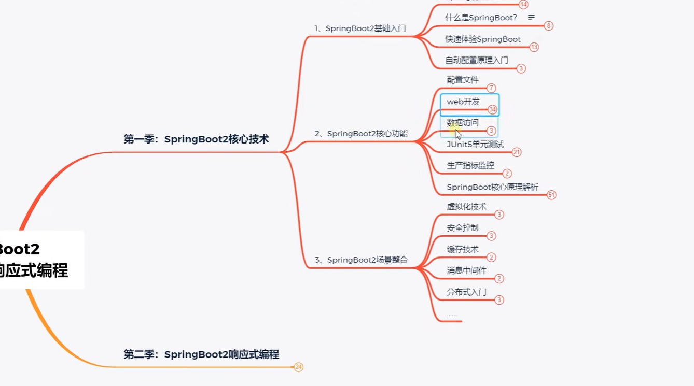
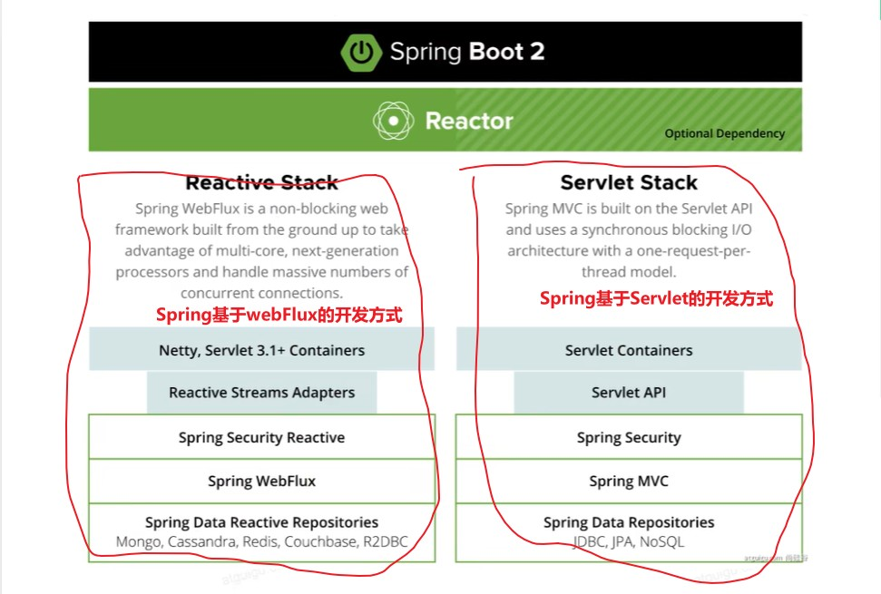

# 前言

## ①学习大纲



## ②Spring的两种开发方式




# 一、Spring与SpringBoot的关系

```markdown
1. Spring生态体系有着大量框架技术栈，联合使用时会产生非常多的配置，十分不利于开发，SpringBoot就是整合这些框架的技术。简化配置
2. SpringBoot是一个高层框架，底层就是Spring
```


# 二、SpringBoot简介

## ①特性

~~~markdown
1. 使用starter简化配置。自动引入Spring的开发依赖

2. 自动整合第三方框架，不用手动配置

2. 内嵌了web服务器，如Tomcat。
~~~


# 三、微服务与分布式简介

## ①微服务

```markdown
1. 微服务是一种架构风格，指的是一个项目拆分成多个的小项目，每个小项目独立运行部署和升级

2. 每个小的项目就是一个微服务，每一个服务可以用不同的语言，存储技术。
```

## ②分布式

~~~markdown
1. 什么是分布式：
 		当一个大型应用分成多个微服务之后，每个微服务都独立部署在服务器上，它们之间相互配合完成业务，此时就产生分布式	
 		
2. 分布式出现之后又会产生各种分布式问题。
		远程调用：部署在不同服务器上的微服务相互调用
		
		服务发现：A服务需要调用B服务，B服务在多个服务器上都有部署，A服务调用哪一个服务器上的B服务都可以，但是需要知道B服务的服务器是否正常，此时就需要服务发现
		
		负载均衡：A服务发现多个服务器上都有部署B服务器，怎么调用？此时就需要负载均衡
		
		服务容错：A服务调用B服务，调用过程中出错怎么办，此时就需要服务容错机制。
		
		配置管理：B服务存在多个服务器上，如果需要修改B的配置与代码，逐一修改部署时很麻烦的，此时就需要配置管理。B服务从配置中心把最新的配置自动同步过来
		
		服务监控：监控每一个服务的运行状态
		
		链路追踪：多个服务开始调用，调用过程中产生了问题。就需要链路追踪来定位问题
		
		日志管理：对分布式应用的日志记录
		
		任务调度
		
		.....	
		
		
SpringBoot快速构建一个应用，其中微服务模块众多，使用SpringCloud把各种微服务整合起来
~~~

