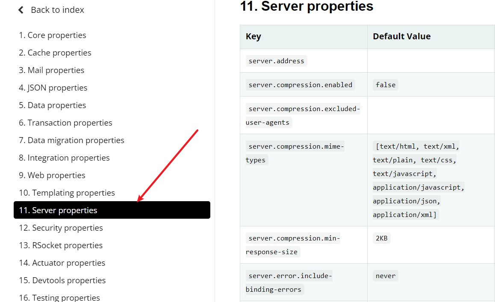
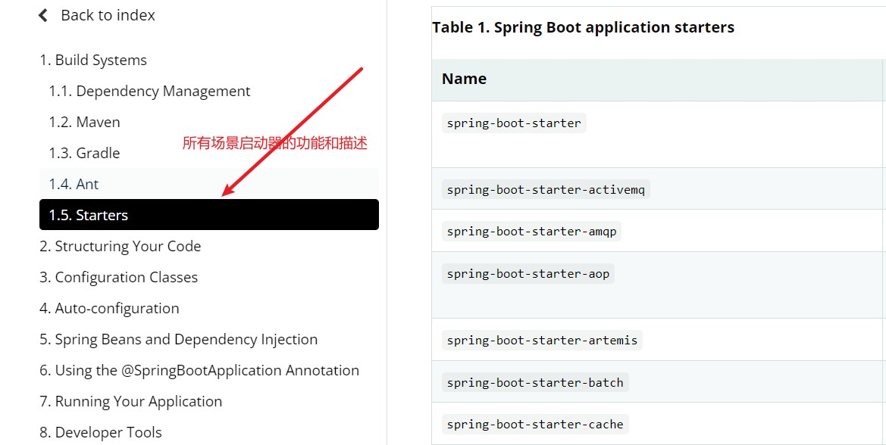

# 一、第一个SpringBoot程序

## ①创建Maven工程

- 标识当前项目是一个SpringBoot项目，并继承父工程依赖的版本号（依赖管理）

```xml
<parent>
    <groupId>org.springframework.boot</groupId>
    <artifactId>spring-boot-starter-parent</artifactId>
    <version>2.3.12.RELEASE</version>
</parent>
```


## ②引入SpringBoot的web场景依赖

- Web场景的依赖，这一个依赖替代传统SSM开发引入的所有依赖

~~~xml
<dependencies>
    <dependency>
        <groupId>org.springframework.boot</groupId>
        <artifactId>spring-boot-starter-web</artifactId>
    </dependency>
</dependencies>
~~~


## ③创建主程序

~~~java
//使用注解标识这个类是web程序的启动类
@SpringBootApplication
public class MainApplication {
    public static void main(String[] args) {
        //固定写法，表示启动web程序，它的返回值是IOC工厂
        SpringApplication.run(MainApplication.class,args);
    }
}

//SpringBoot有默认的包扫描机制，主程序所在的包及其子包的所有组件都会被默认扫描。 
~~~


## ④编写业务

```
与SSM开发方式一样
```


## ⑤测试

```
直接运行main方法
```


## ⑥简化配置

```
使用application.properties配置文件
```



## ⑦简化部署

- 直接在maven中添加，然后打包会生成jar包，包中自带tomcat服务器，只需要把jar包放在当作服务器的电脑上使用java -jar xx.jar运行就可访问SpringBoot开发的web程序了

~~~xml
<build>
    <plugins>
        <plugin>
            <groupId>org.springframework.boot</groupId>
            <artifactId>spring-boot-maven-plugin</artifactId>
        </plugin>
    </plugins>
</build>
~~~


# 二、依赖管理

```xml
我们自己的SpringBoot的pom文件
<parent>
    <groupId>org.springframework.boot</groupId>
    <artifactId>spring-boot-starter-parent</artifactId>
    <version>2.3.12.RELEASE</version>
</parent>


在SpringBoot程序的pom中引入了父spring-boot-starter-parent，父依赖如下
<parent>
    <groupId>org.springframework.boot</groupId>
    <artifactId>spring-boot-dependencies</artifactId>
    <version>2.3.12.RELEASE</version>
</parent>


spring-boot-starter-parent还有一个父依赖spring-boot-dependencies，在spring-boot-dependencies中，引入了所有具体开发时需要使用的依赖及其版本号。如数据库连接
 <properties>
    <mysql.version>8.0.25</mysql.version>
     ...
</properties>>

 <dependency>
     <groupId>mysql</groupId>
     <artifactId>mysql-connector-java</artifactId>
     <version>${mysql.version}</version>
     <exclusions>
         <exclusion>
             <groupId>com.google.protobuf</groupId>
             <artifactId>protobuf-java</artifactId>
         </exclusion>
     </exclusions>
</dependency>
如果在我们自己的SpringBoot的pom文件中不添加版本号，则默认使用spring-boot-dependencies中定义的版本号。


如果需要使用特定的依赖版本，则不能使用spring-boot-dependencies默认的版本号，需要在我们自己的pom中重写覆盖，代码如下
<properties>
    <mysql.version>版本号</mysql.version>
</properties>

```

```
注意：在spring-boot-dependencies中已经声明的依赖可以不写版本号用默认的，如果其中没有声明，依赖该怎么引入就怎么引入
```


# 三、Starter场景启动器

```xml
//最基础的场景启动器，所有的场景启动器都是基于spring-boot-starte启动器的，如spring-boot-starter-web
<dependency>
    <groupId>org.springframework.boot</groupId>
    <artifactId>spring-boot-starte</artifactId>
</dependency>


//web场景启动器，是基于spring-boot-starte的，只需要引入这个场景启动器SpringBoot就会自动引入web开发所需要的全部jar包
 <dependency>
     <groupId>org.springframework.boot</groupId>
     <artifactId>spring-boot-starter-web</artifactId>
</dependency>

也有其他场景启动器，如'spring-boot-starter-redies','spring-boot-starter-jdbc'等等


```



# 四、了解自动配置

## ①Tomcat

```markdown
1. 自动引入tomcat：在引入web场景的时候，web场景中引入了Tomcat场景

2. 自动配置tomcat：
```

##  ②SpringMVC

```markdown
1. 自动引入SpringMVC：在引入web场景的时候，web场景中引入了spring-web依赖与spring-webmvc依赖

2. 自动配置SpringMVC：自动配置了常用的web功能，如视图解析，文件上传下载，前端控制器...，
					可以通过主程序启动返回的工厂来查看配置了哪些组件
```

## ③包扫描

```markdown
1. SpringBoot有默认的包扫描机制，主程序所在的包及其子包的所有组件都会被默认扫描。 无需手动配置包扫描

2. 如何使用自定义的包扫描机制：@SpringBootApplication(scanBasePackage = " ")
	
```

## ④application.properties配置项的默认值

```
原理在Spring的笔记中'Spring高级注解'中有
```

## ⑤按需加载

```
SpringBoot中有很多starter启动器，不是启动程序就全部加载的，而是pom文件中引入了哪个启动器就加载哪个启动器。

按需加载全部在spring-boot-autoconfiggure中定义
```

