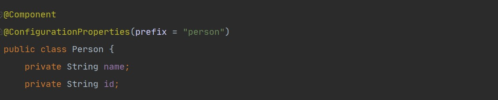
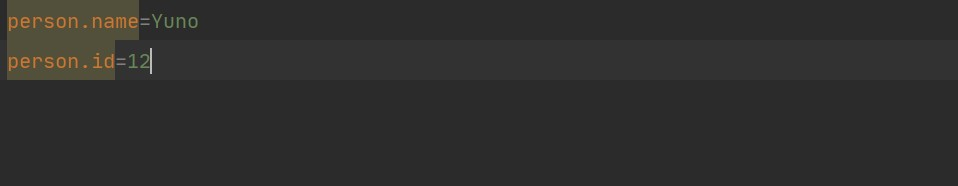
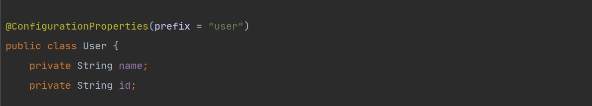
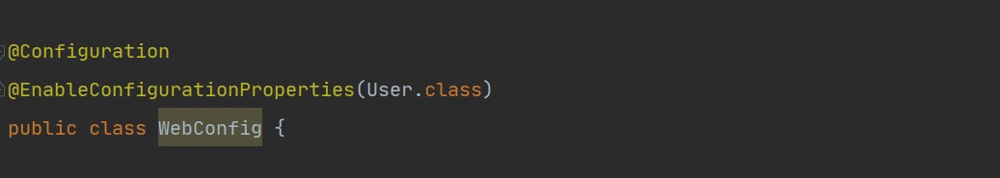
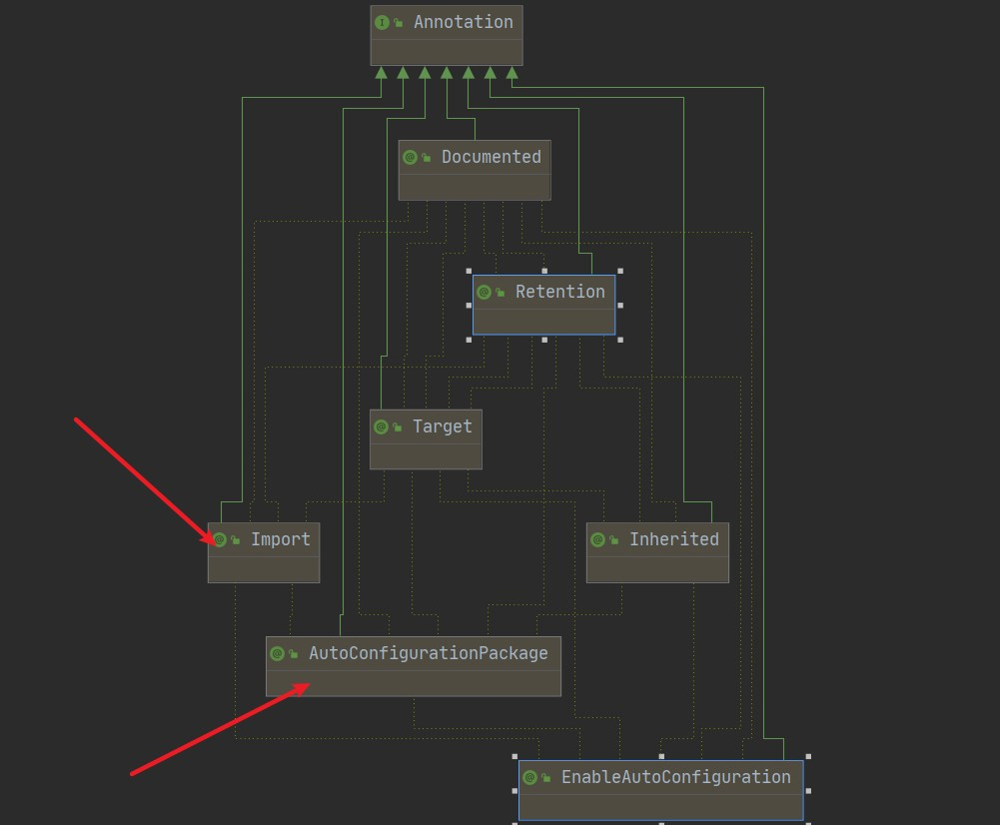
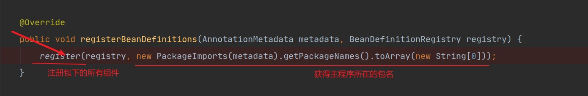
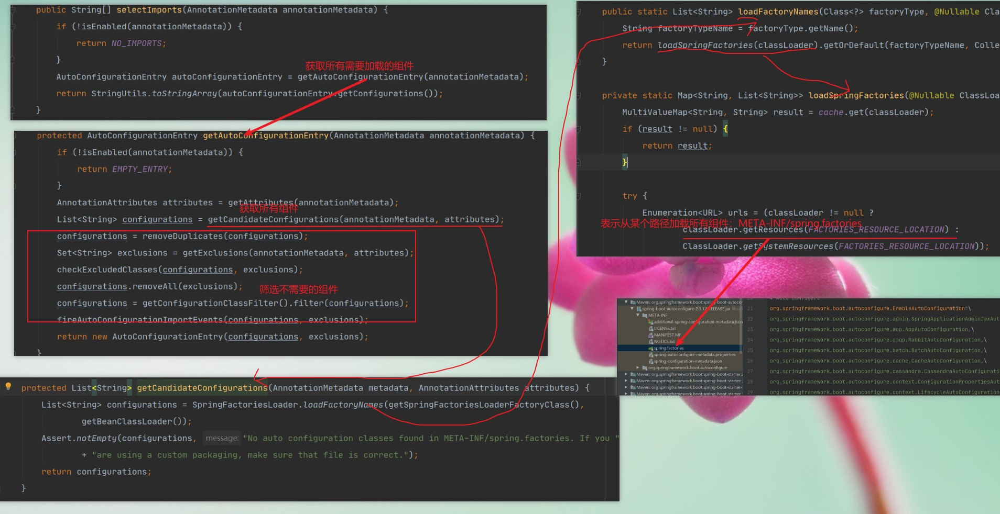
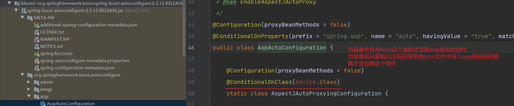

# 一、组件注册

## ①@Configuration

## ②@Bean、@Component相关

## ③@Import

## ④@Conditional

```
Spring高级注解的笔记中有讲解。略
```

# 二、配置文件的数据绑定

## ①解释

```
读取properties配置文件中的数据，加载到Bean对象中就是配置绑定
```


## ②@ConfigurationProperties





```
注意：Person需要交给Spring容器管理
```


## ③@EnableConfigurationProperties(xx.class)





```
有些时候我们需要使用的对象并没有源码，而是第三方组件，它只有一个ConfigurationProperties注解，没有@Component。并不在容器中，
这个时候我们需要把它交给容器管理就要用到@EnableConfigurationProperties注解

注意：@EnableConfigurationProperties只能用在配置类上

```

# 三、自动配置原理入门

```markdown
@SpringBootApplication是一个复合注解，它被三个元注解修饰，如下：

@SpringBootConfiguration
@EnableAutoConfiguration
@ComponentScan(excludeFilters = { @Filter(type = FilterType.CUSTOM, classes = TypeExcludeFilter.class),
		@Filter(type = FilterType.CUSTOM, classes = AutoConfigurationExcludeFilter.class) })
```


## ①引导加载配置类

### Ⅰ、@SpringBootConfiguration

```
@SpringBootConfiguration的元注解是@Configuration,说明被@SpringBootConfiguration修饰的类是配置类
```


### Ⅱ、@EnableAutoConfiguration



```markdown
1. @EnableAutoConfiguration的元注解是
		(1)@AutoConfigurationPack
		(2)@Import(AutoConfigurationImportSelector.class)

2. @Import(AutoConfigurationImportSelector.class)：主要用来做组件配置的自动装配，
   从AutoConfigurationImportSelector.class类中的selectImports()开始执行，流程见图三

3. @AutoConfigurationPack的元注解是@Import(AutoConfigurationPackages.Registrar.class)
		在AutoConfigurationPackages.Registrar.class这个类中批量注册了主程序所在包的组件：如图二
```


图二




图三




## ②按需开启自动配置

```
在META-INF/spring.factroies中有127个自动配置类，容器当然不可能全部加载，此时就需要按需加载，即导入了什么组件就加载什么组件的配置类

注意：以aop举例，这里加载的不是aop相关的jar包，而是aop的配置。按需加载只有在pom文件中导入了aop的依赖才会自动加载aop相关的配置
```




## ③总结

- SpringBoot会加载所有的配置类（xxxAutoConfiguration）

- 每个配置类会按照条件进行生效，一旦生效相当于配置类配置的功能就可以使用了，每一个配置类都会默认绑定配置文件中的值，如果不使用配置文件中的值，则就使用SpringBoot提供的默认值。

- 如果开发者自己对某些功能已经进行配置了，那么SpringBoot就不会加载默认的配置类，而是使用开发者自定义的配置

- 对配置进行定制

  - 直接使用@Bean创建一个组件覆盖SprigBoot提供的默认组件
  - 直接修改配置文件中的值，让SpringBoot默认配置类使用我们自己定义的值。

  

- 查看自动配置类有没有生效：在配置文件中开启自动配置报告debug=true

# 四、SpringBoot开发技巧

## ①Lombok

```markdown
简化JavaBean的开发

注意：因为使用Lombok需要安装插件，所以团队开发的时候千万不要用这个Lombok

1. 导入Lombok的依赖

2. 安装Lombok插件

3. 使用Lombok的注解
        @Data：生成get和set

        @NoArgsConstructor：生成空参构造器

        @AllArgsConstructor：生成满参构造器

        @ToString：生成toString
        
        @EqualsAndHashCode:重写这两个方法
        
        @Slf4j：注入日志属性，
        使用这个注解之后会在当前类生成一个log的变量，使用log.info可以把信息打印到日志，再也不用输出到控制台了
        
		
		注意：
			（1）lombok所有生成的方法和属性都是在编译期生成的
			（2）对lombok生成的方法不满意可以自己手写。不一定非要用lombok给我们生成的方法
```


## ②JRebel

```
对项目进行热部署，修改代码之后不重启项目

```


## ③Spring Inintalizer

```
快速生成一个项目

注意：在初始化SpringBoot项目的时候会选择SpringBoot的版本，有些版本阿里云的镜像是没有对应的jar包的
```

