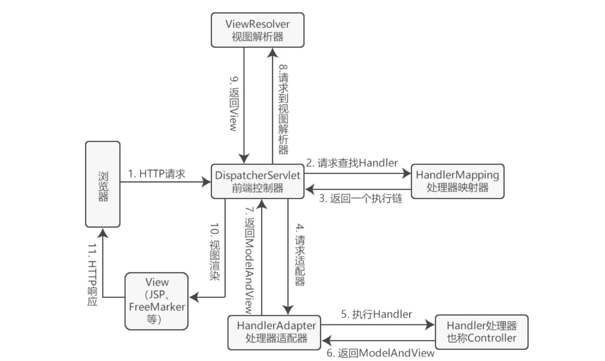
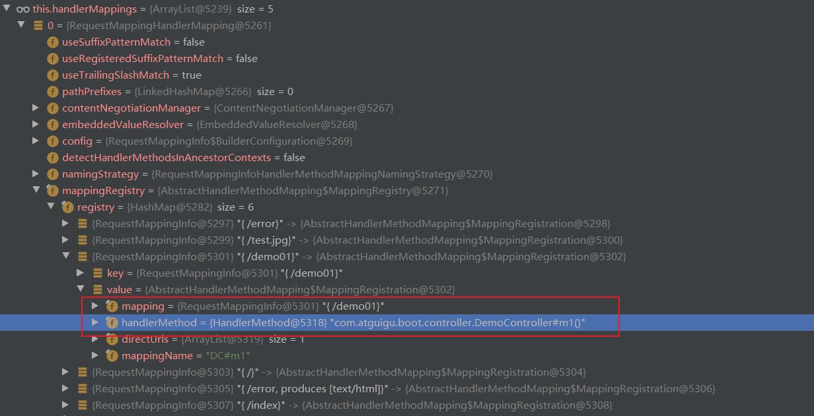
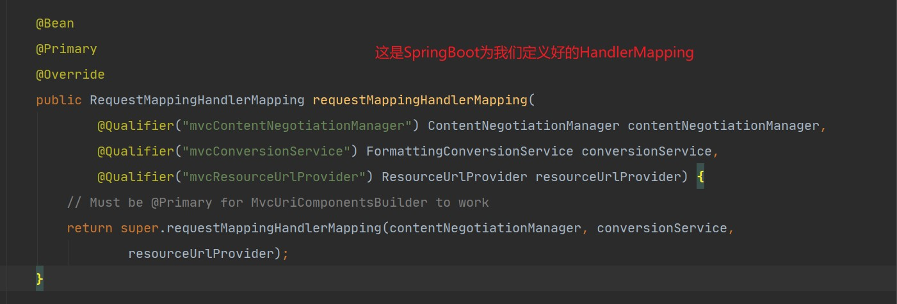
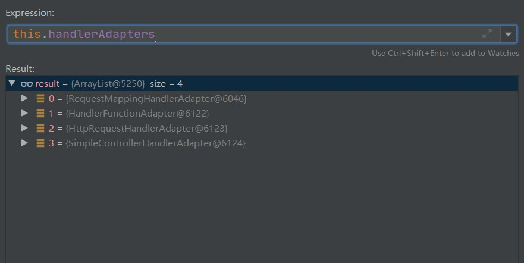
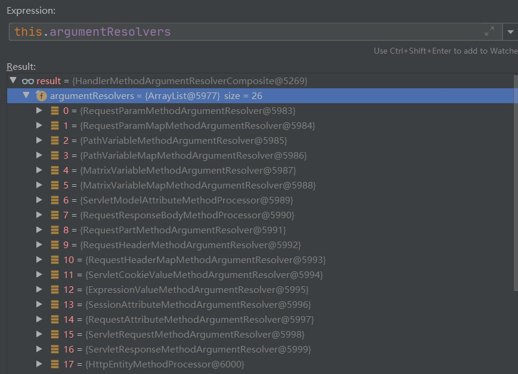
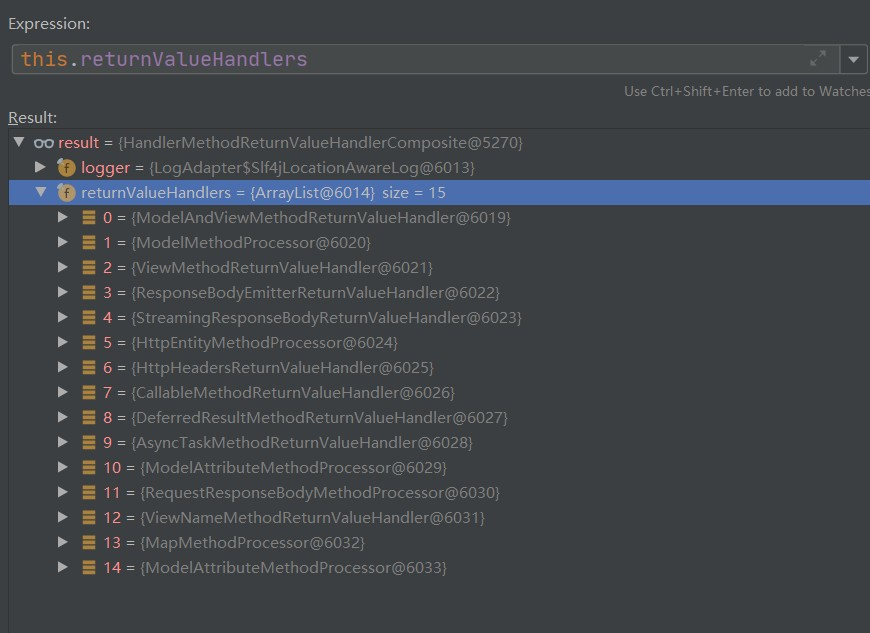

# 一、简单功能

## ①静态资源访问

### Ⅰ、默认的静态资源访问路径

```markdown
1. SpringBoot为我们提供了默认的静态资源访问目录，默认拦截规则是/**

默认提供的静态资源访问路径是类路径下的：
😙/static
😙/public 
😙/resources
😙/META-INF/resources

```

### Ⅱ、自定义静态资源访问的前缀

```markdown
🈲配置：springmvc.static-path-pattern: /res/**

🈲解释：自定义前缀不是自定义路径，不需要新建文件夹，只需要在url访问的时候多加一层路径就可以了--->localhost:8080/res/xxx

🈲使用场景：在配置拦截器的时候可以给静态资源添加前缀防止被拦截
```

### Ⅲ、自定义静态资源访问目录的路径

```markdown
🈲配置：spring.resources.static-locations: classpath:/xxx/

🈲解释：与自定义访问前缀不同，此时就需要新建文件夹了。因为Boot提供默认的静态资源访问路径已经被覆盖了
```

### Ⅳ、webjars

```
了解就可以了，就是把前端的一些框架以依赖的形式进行导入

例如jQuery可以直接导入依赖
```

### Ⅴ、静态资源访问补充

```markdown
1. 访问顺序
如果控制器路径与静态资源路径一直，先找控制器路径，再找静态资源路径，都没有找到则404
controller	 ->	  /META-INF/resources	 ->		/resources		->		/static 	->		/public 

2. 拦截路径
💘：/ 拦截所有请求 包括静态资源和动态请求 但是不拦截jsp
💘：/*拦截所有请求 包括静态资源和动态请求 也拦截jsp

💘/**的意思是所有文件夹及里面的子文件夹
💘/*是所有文件夹，不含子文件夹
路径规则详解链接：https://www.cnblogs.com/searain/articles/8391773.html
```


## ②欢迎页

### Ⅰ、静态方式欢迎页

```markdown
放在静态资源南路径下，文件名index.html

注意：使用静态方式欢迎页就不能配置静态资源的访问前缀，因为冲突了。
欢迎页的访问方式是 '/',带前缀的访问方式是'/xx/',因为配置了前缀，访问静态页面需要加'/xx/'所以'/'失效了
```


### Ⅱ、动态方式欢迎页

```markdown
处理"/index"请求的controller
```


### Ⅲ、欢迎页底层处理规则

```java
/*
1. HandlerMapping:处理映射器，保存了每个Handler能处理哪个请求

2. WelcomePageHandlerMapping就是专门处理欢迎页的请求的Hanlder


*/


@Bean
public WelcomePageHandlerMapping welcomePageHandlerMapping(
    ApplicationContext applicationContext,
    FormattingConversionService mvcConversionService, 
    ResourceUrlProvider mvcResourceUrlProvider)
{		
    	//WelcomePageHandlerMapping构造器看‘代码片段1’
    	WelcomePageHandlerMapping welcomePageHandlerMapping = new WelcomePageHandlerMapping
        (
        	new TemplateAvailabilityProviders(applicationContext), 
        	applicationContext, 
        	getWelcomePage()，
        	this.mvcProperties.getStaticPathPattern()//这个StaticPathPattern就是我们配的前缀
    	);
    
    welcomePageHandlerMapping.setInterceptors(getInterceptors(mvcConversionService, mvcResourceUrlProvider));
    welcomePageHandlerMapping.setCorsConfigurations(getCorsConfigurations());
    return welcomePageHandlerMapping;
}


/*代码片段1*/
WelcomePageHandlerMapping(TemplateAvailabilityProviders templateAvailabilityProviders,
                          ApplicationContext applicationContext, Resource welcomePage, String staticPathPattern) {
    
    /*
    这里解释了为什么访问静态欢迎页加了前缀后欢迎页失效了，访问静态资源配了前缀后访问路径就不是/**了，而是配的前缀加资源名
    所以自然不会进入这个if语句
    */
    if (welcomePage != null && "/**".equals(staticPathPattern)) {
        logger.info("Adding welcome page: " + welcomePage);
        setRootViewName("forward:index.html");
    }
    //否则就使用动态欢迎页的方式，看那个Controller能处理'/index'请求
    else if (welcomeTemplateExists(templateAvailabilityProviders, applicationContext)) {
        logger.info("Adding welcome page template: index");
        setRootViewName("index");
    }
}


```


## ③自定义Favion

```markdown
图标需要放在静态资源文件夹下，名字叫facicon.ico

注意：自定义前缀会让图标失效
```


**问题：因为自定义前缀会让图标和欢迎页失效，所以要结合自定义前缀与自定义静态资源访问路径一起使用吗？有空再进行测试**


## ④静态资源自动配置原理

### Ⅰ、WebMvcAutoConfigurationAdapter的注解

```java
SpringMVC相关的配置大部分都在`WebMvcAutoConfiguration`这个配置类中的`WebMvcAutoConfigurationAdapter`内部类中。当然也包括静态资源的处理，在`WebMvcAutoConfigurationAdapter`有一个方法用作静态资源处理，看下面源码


//内部类
@Configuration(proxyBeanMethods = false)
@Import(EnableWebMvcConfiguration.class)
@EnableConfigurationProperties({ WebMvcProperties.class, ResourceProperties.class })
@Order(0)
public static class WebMvcAutoConfigurationAdapter implements WebMvcConfigurer {
}

/*

@EnableConfigurationProperties({ WebMvcProperties.class, ResourceProperties.class })
1. 导入WebMvcProperties这个类到容器(prefix = "spring.mvc")
2. 导入ResourceProperties这个类到容器(prefix = "spring.resources")
*/


```


### Ⅱ、WebMvcAutoConfigurationAdapter构造器

```java

//内部类的构造器
public WebMvcAutoConfigurationAdapter(
        ResourceProperties resourceProperties,//从容器中找到ResourceProperties
        WebMvcProperties mvcProperties,//从容器中找到WebMvcProperties
        ListableBeanFactory beanFactory,//获取IOC工厂
        ObjectProvider<HttpMessageConverters> messageConvertersProvider,
    
        //资源处理器的自定义器
        ObjectProvider<ResourceHandlerRegistrationCustomizer> resourceHandlerRegistrationCustomizerProvider,
        ObjectProvider<DispatcherServletPath> dispatcherServletPath,//找到前端控制器的处理路径
        ObjectProvider<ServletRegistrationBean<?>> servletRegistrations//给应用注册servlet,监听器，拦截器...
	)

{
    this.resourceProperties = resourceProperties;
    this.mvcProperties = mvcProperties;
    this.beanFactory = beanFactory;
    this.messageConvertersProvider = messageConvertersProvider;
    this.resourceHandlerRegistrationCustomizer = resourceHandlerRegistrationCustomizerProvider.getIfAvailable();
    this.dispatcherServletPath = dispatcherServletPath;
    this.servletRegistrations = servletRegistrations;
}
```

### Ⅲ、WebMvcAutoConfigurationAdapter处理静态资源的方法

```java
@Override
public void addResourceHandlers(ResourceHandlerRegistry registry) {
     //可以通过配置addMapping来设置是否可以访问静态资源
    if (!this.resourceProperties.isAddMappings()) {
        logger.debug("Default resource handling disabled");
        return;
    }
    
    //调用方法注册访问路径与静态资源的映射
    addResourceHandler(registry, "/webjars/**", "classpath:/META-INF/resources/webjars/");
    
    //默认的静态资源访问路径是/**对应的资源是getStaticLocations()中的'static','public'...等等
    addResourceHandler(registry, this.mvcProperties.getStaticPathPattern(),
                       this.resourceProperties.getStaticLocations());
}


/*-------------------------------------------------------------------------------------*/

private void addResourceHandler(ResourceHandlerRegistry registry, String pattern, String... locations) {
    //如果这个访问路径有静态资源映射则不注册
    if (registry.hasMappingForPattern(pattern)) {
        return;
    }
    
    //访问路径没有对应的静态资源映射就进行注册
    ResourceHandlerRegistration registration = AutoConfigurationResourceHandlerRegistry
        .addResourceHandler(registry, RegistrationType.AUTO_CONFIGURATION, pattern);
    registration.addResourceLocations(locations);//注册访问路径对应的静态资源路径
    registration.setCachePeriod(getSeconds(this.resourceProperties.getCache().getPeriod()));//静态资源的缓存机制
    registration.setCacheControl(this.resourceProperties.getCache().getCachecontrol().toHttpCacheControl());
    customizeResourceHandlerRegistration(registration);
}


例子：
    访问'/webjars/**'的时候实际上会访问'classpath:/META-INF/resources/webjars/',因为SpringBoot做了静态资源与路径的映射


```

# 二、SpringMVC执行流程原理

## 补充①1SpringMVC的执行流程



## 补充②SpringMVC接受哪些参数

### Ⅰ、可以用注解修饰参数

```java
1. @PathVariable
2. @RequestHeader
3. @RequestParam
4. @CookValue
5. @MatrixVariable //获取矩阵变量
6. @RequestBody
7. @ModelAttribute //使用在控制器方法形参上，接受参数的同时放在Model中
8. @SessionAttribute //把Model的数据放在Session中
```


### Ⅱ、Servlet API

```
1. HttpSession
2. HttpRquest
3. HttpResponse
.....
```


### Ⅲ、复杂参数

```
1. Model
2. ModelMap
3. RedirectAttribute
.....
```


## ①RESTFul使用原理

```java
1. 在SpringMVC中有笔记，略

2. 注意：在SpringBoot中需要手动开启设置才能使用RESTFul的请求,spring.mvc.hiddenmethod.filter: true

	@Bean
    //没有HiddenHttpMethodFilter才执行，所以我们进行可以自定义HiddenHttpMethodFilter来覆盖默认的HiddenHttpMethodFilter
	@ConditionalOnMissingBean(HiddenHttpMethodFilter.class)
	@ConditionalOnProperty(prefix = "spring.mvc.hiddenmethod.filter", name = "enabled", matchIfMissing = false)
	public OrderedHiddenHttpMethodFilter hiddenHttpMethodFilter() {
		return new OrderedHiddenHttpMethodFilter();
	}
```

 


## ②请求映射的原理（SpringMVC执行流程中获取handler执行链的原理）

```markdown
1. 每次发请求，到底是怎么找到对应的方法从而进行处理的？

2. SpringBoot请求映射的原理就是SpringMVC请求映射的原理

```

```java
1. 首先DispatcherServlet是一个Servlet，继承了HTTPServlet，请求进来时会执行doGet或者doPost方法，而DispatcherServlet的父类重写了doGet，doPost..这些方法。最终会执行DispatcherServlet中的doServlet(),doServlet()又调用了doDispatch()

所以只需要分析doDispatch()就可以了


//doDispatch()核心代码如下
protected void doDispatch(HttpServletRequest request, HttpServletResponse response) throws Exception {
	
    ......
    
	//获取当前请求对应的handler
    //就是获取HandlerExecutionChain，这个对象中包含了handlerMethod（url对应的处理方法），流程看'代码片段1'
    mappedHandler = getHandler(processedRequest);
    
    .......

}

看源码之前搞清楚一件事：
	1. HanlderMapping中保存了所有访问路径与处理器方法映射
    2. HanlderMapping是一个接口，具体保存映射规则的是它的实现类，如RequestMappingHanlderMapping

//以下是'代码片段1'
@Nullable
protected HandlerExecutionChain getHandler(HttpServletRequest request) throws Exception {
    //handlerMappings保存了所有的handlerMapping，见'Ⅰ、HandlerMapping'
    if (this.handlerMappings != null) {
        
        /*
        遍历handlerMappings中的所有HandlerMapping，直到找到与请求路径匹配的HandlerExecutionChain。在这个例子中一共有5个		HandlerMapping
        */
        for (HandlerMapping mapping : this.handlerMappings) {
            //在mapping.getHandler(request)中又调用了getHandlerInternal(request)，见'代码片段2'
            HandlerExecutionChain handler = mapping.getHandler(request);
            if (handler != null) {
                //找到了对应的处理器就返回，否则返回null
                return handler;
            }
        }
    }
    return null;
}


//以下是'代码片段2'
@Override
protected HandlerMethod getHandlerInternal(HttpServletRequest request) throws Exception {
    //从request中获取当前请求的URL
    String lookupPath = getUrlPathHelper().getLookupPathForRequest(request);
    
    request.setAttribute(LOOKUP_PATH, lookupPath);
    
    //this就是代码片段1中被遍历的HanlderMapping
    //加了一把锁，防止并发查询this.mappingRegistry
    this.mappingRegistry.acquireReadLock();
    try {
        //由这个方法决定当前请求到底是由哪个HandlerMethod来处理，看'代码片段3'
        HandlerMethod handlerMethod = lookupHandlerMethod(lookupPath, request);
        //返回得到的结果
        return (handlerMethod != null ? handlerMethod.createWithResolvedBean() : null);
    }
    finally {
        //释放this.mappingRegistry的锁
        this.mappingRegistry.releaseReadLock();
    }
}


//以下是'代码片段3'
@Nullable
/*
    lookupPath:当前请求的请求路径
    request：当前请求对象
*/
protected HandlerMethod lookupHandlerMethod(String lookupPath, HttpServletRequest request) throws Exception {
    List<Match> matches = new ArrayList<>();
    
  	//按照请求的URL进行匹配得到对应的RequestMappingMappingInfo放在directPathMatches中
    List<T> directPathMatches = this.mappingRegistry.getMappingsByUrl(lookupPath);
    
    if (directPathMatches != null) {
      	//有可能一个URL对应多个控制器方法，所以需要按照请求方式进行二次匹配，得到RequestMappingMappingInfo放在matches中
        addMatchingMappings(directPathMatches, matches, request);
    }
    
    //如果保存matches为空，说明请求路径没有对应的处理器方法，执行其他逻辑
    if (matches.isEmpty()) {
        // No choice but to go through all mappings...
        addMatchingMappings(this.mappingRegistry.getMappings().keySet(), matches, request);
    }
	
    //如果matches不为空，说明请求路径有对应的处理器方法
    if (!matches.isEmpty()) {
        
        //从matches中得到RequestMappingMappingInfo
        Match bestMatch = matches.get(0);
        
        //在进行了根据URL和请求方式过滤后，matches.size() > 1,说明处理该请求的控制器方法有多个，这是不允许的，抛异常
        //所以SpringMVC要求我们通用的请求，同样的请求方式，只能由一个控制器方法来处理
        if (matches.size() > 1) {
            .....
            //抛异常的代码
        }
        request.setAttribute(BEST_MATCHING_HANDLER_ATTRIBUTE, bestMatch.handlerMethod);
        handleMatch(bestMatch.mapping, lookupPath, request);
        return bestMatch.handlerMethod;//返回最优匹配的handlerMethod
    }
    else {
        return handleNoMatch(this.mappingRegistry.getMappings().keySet(), lookupPath, request);
    }
}

```


### Ⅰ、HandlerMapping


```
1. RequestMappingHandlerMapping：保存了所有@RequestMapping注解中的URL与对应的的控制器处理方法

注意：RequestMappingHandlerMapping中的每一个URL与处理器方法的映射都由RequestMappingInfo对象保存，看下图
```



```
2. WelcomePageHanlderMapping: 保存了欢迎页访问路径'/'与对应处理方法的hanlderMapping
```

```
补充：RequestMappingHandlerMapping与WelcomePageHanlderMapping都是SPringBoot为我们提供的

我们也可以定义自己的HanlderMapping来自定义映射规则，只需要在配置类中用@Bean
```




## ③接受请求参数的原理（SpringMVC执行流程中获取handlerAdapter到返回ModelAndView的原理）

```
当在控制器方法上使用了各类注解接受参数时，SpringMVC是如何解析出数据的
```

```java
还是一样从doDispatch开始分析


protected void doDispatch(HttpServletRequest request, HttpServletResponse response) throws Exception {
	
    ......
    
    //获取HandlerExecutionChain，这个对象中包含了handlerMethod（url对应的处理方法）
    mappedHandler = getHandler(processedRequest);
    
    
    /*
    1. HandlerAdapter解释看'代码片段1'
    2. 经过getHandler(processedRequest)虽然已经得到的url对应的handlerMethod，还要获取handlerMethod方法的实参并赋值
    3. 把HandlerExecutionChain中的HandlerMethod当作参数传入获取HandlerMethod的适配器（流程看'代码片断2'）
    4. 大多数情况下获取的适配器是RequestMappingHandlerAdapter
    */
    HandlerAdapter ha = getHandlerAdapter(mappedHandler.getHandler());
    
    .......
        
    /*
    1. 真正的执行handlerMethod，执行完成返回一个ModelAndView视图用mv接收
    2. 不是直接去执行handlerMethod的，而是通过适配器的的handle()方法来执行，
       在这个例子中也就是RequestMappingHandlerAdapter的handle()方法
    3. mappedHandler.getHandler()就是从HandlerExecutionChain获取当前的handlerMethod
    4. ha.handle()的执行流程见'代码片段3'
    */
    mv = ha.handle(processedRequest, response, mappedHandler.getHandler());
    
    
    .......


}

//以下是'代码片段1'
public interface HandlerAdapter {
	//当前的适配器能处理哪个handler
	boolean supports(Object handler);
	
    //如果适配器支持处理handler就执行handle()执行这个真正的handler
	ModelAndView handle(HttpServletRequest request, HttpServletResponse response, Object handler) throws Exception;

}


//以下是代码片段2
//参数handler就是处理当前请求的handlerMethod
protected HandlerAdapter getHandlerAdapter(Object handler) throws ServletException {
    //this.handlerAdapters解释看'图1'
    if (this.handlerAdapters != null) {
        //遍历所有的适配器(根据图1看出一个有5个)，看具体哪个适配器能处理当前的handlerMethod,能处理就返回这个适配器
        for (HandlerAdapter adapter : this.handlerAdapters) {
            if (adapter.supports(handler)) {//这里的判断规则是：'return handler instanceof HandlerMethod'
                return adapter;
            }
        }
    }
    throw new ServletException("No adapter for handler [" + handler +
                               "]: The DispatcherServlet configuration needs to include a HandlerAdapter that 								supports this handler");
}


//以下是'代码片段3'
@Override
@Nullable
public final ModelAndView handle(HttpServletRequest request, HttpServletResponse response, Object handler)
    throws Exception {
    //因为获取的适配器是RequestMappingHandlerAdapter，所以最终执行的是RequestMappingHandlerAdapter的handleInternal方法
    //执行流程看'代码片段4'
    return this.handleInternal(request, response, (HandlerMethod) handler);
}


//以下是'代码片段4'
@Override
protected ModelAndView handleInternal(HttpServletRequest request,
                                      HttpServletResponse response, 
                                      HandlerMethod handlerMethod) throws Exception 
{
    ModelAndView mav;
    if (this.synchronizeOnSession) {
        .....
    }
    else {
        //执行目标方法，也就是执行目标handlerMethod，这个方法也是RequestMappingHandlerAdapter中的，执行流程见'代码片段5'
        mav = invokeHandlerMethod(request, response, handlerMethod);
    }
    .....
    return mav;
}


//以下是代码片段5
@Nullable
protected ModelAndView invokeHandlerMethod(HttpServletRequest request,
                                           HttpServletResponse response, 
                                           HandlerMethod handlerMethod) throws Exception 
{	
    ...//初始化过程
        
        
    try {
        //用于保存参数解析器 与 返回值处理器，以及执行目标方法
        ServletInvocableHandlerMethod invocableMethod = createInvocableHandlerMethod(handlerMethod);
        
        //this.argumentResolvers参数解析器，在执行目标方法前解析方法上的参数，确定目标方法的具体实参。解释见'图2'
        if (this.argumentResolvers != null) {
            //把参数解析器保存在invocableMethod中
            invocableMethod.setHandlerMethodArgumentResolvers(this.argumentResolvers);
        }
        
        //this.returnValueHandlers,返回值处理器， 具体解释解释见'图3'
        if (this.returnValueHandlers != null) {
            //把返回值处理器保存在invocableMethod中
            invocableMethod.setHandlerMethodReturnValueHandlers(this.returnValueHandlers);
        }

		.......
            
        //执行目标方法，执行流程见代码片段6
        invocableMethod.invokeAndHandle(webRequest, mavContainer);
		        
        
        .......
		
        return getModelAndView(mavContainer, modelFactory, webRequest);
    }
    finally {
        webRequest.requestCompleted();
    }
}


//以下是代码片段6(org.springframework.web.servlet.mvc.method.annotation.ServletInvocableHandlerMethod中的方法)
public void invokeAndHandle(ServletWebRequest webRequest, 
                            ModelAndViewContainer mavContainer,
							Object... providedArgs) throws Exception 
{
		
    	//真正执行目标处理方法。见代码片段7
    	//returnValue就是目标方法的返回值
		Object returnValue = invokeForRequest(webRequest, mavContainer, providedArgs);

}


//代码片段7（org.springframework.web.method.support.InvocableHandlerMethod）
@Nullable
public Object invokeForRequest(NativeWebRequest request, 
                               @Nullable ModelAndViewContainer mavContainer,
                               Object... providedArgs) throws Exception {
	
    //获取目标方法形参的参数值。见代码片段8
    Object[] args = getMethodArgumentValues(request, mavContainer, providedArgs);
    if (logger.isTraceEnabled()) {
        logger.trace("Arguments: " + Arrays.toString(args));
    }
    //把形参的参数值传如并反射执行目标方法
    return doInvoke(args);
}


//以下是代码片段8（org.springframework.web.method.support.InvocableHandlerMethod）

/*
1. 获取参数解析器
2. 解析参数的name与value

源码分析暂停，太难了。目前到了控制器方法的参数的实参是如何确定的
*/


```


**图1**



```markdown
1. handlerAdapters是DispatcherServlet中的一个List类型的成员。里面装了所有的Handlerdapter

2. 集合中所有的适配器都是HandlerAdapter的子类，所以也会有supports()与handle方法，不同的子类这些方法的具体实现不同

//handlerAdapters集合中存储的具体子类的简单介绍
1. RequestMappingHandlerAdapter : 这个适配器专门处理标注了@RequestMapping的handler
2. HandlerFunctionAdapter : 这个适配器专门处理函数式编程的handler
```


**图2**

```markdown
1. this.argumentResolvers就是RequestMappingHandlerAdapter中名字叫argumentResolvers的成员，它是一个HandlerMethodArgumentResolver的实现类的实例，这个类中有一个List集合保存了26中具体的参数解析器。这26中解析器都是HandlerMethodArgumentResolver的子类
```



```java
根据目标方法的参数使用的注解不同，使用的解析器也不同，有26种参数解析器，也就意味着有控制器方法参数可以写26种类型的参数

//参数解析器接口HandlerMethodArgumentResolver解释
public interface HandlerMethodArgumentResolver {
	
    //判断当前解析器是否支持解析parameter这个参数
	boolean supportsParameter(MethodParameter parameter);
	
	//支持解析后，具体解析的方法
	Object resolveArgument(MethodParameter parameter, @Nullable ModelAndViewContainer mavContainer,
			NativeWebRequest webRequest, @Nullable WebDataBinderFactory binderFactory) throws Exception;
    
    //注意：因为有26钟参数解析器，所以判断的方法与解析的方法都有不同的实现
}

```


**图3**

```
this.returnValueHandlers返回值处理器是RequestMappingHandlerAdapter中名字叫returnValueHandlers的成员，它是一个HandlerMethodReturnValueHandler的实现类的实例，这个类中有一个List集合保存了15中具体的返回值处理器。这15种处理器都是HandlerMethodReturnValueHandler的子类
```



```java
根据方法返回值类型不同，使用的返回值处理器也不同。有15中返回值处理器，也就意味着可以有15种类型的返回值

//返回值处理器接口HandlerMethodReturnValueHandler详解
    
public interface HandlerMethodReturnValueHandler {
	
    //判断该处理器是否能处理returnType
    boolean supportsReturnType(MethodParameter returnType);

    //支持处理后，具体处理的方法
    void handleReturnValue(@Nullable Object returnValue, MethodParameter returnType,
                           ModelAndViewContainer mavContainer, NativeWebRequest webRequest) throws Exception;

}
```

## ④视图解析器原理

```
暂时忽略
```


# 三、拦截器

## ①拦截器的使用

## ②拦截器的原理


# 四、文件上传

##  ①文件上传的使用

## ②文件上传的原理


# 五、错误处理

## ①默认的错误处理机制

- 对于同步请求，会自动生成一个error页面
- 对于异步请求，会自动生成错误的Json信息
- 如果再templates中建立了/error文件夹，那么全局请求出现错误后默认跳转到/error的页面。命名以'4xx.html'，'5xx.html'

## ②错误处理的自动配置原理


## ③SpringBoot中的错误处理的几种方式

- 在templates的error文件夹下使用"4XX","5XX"的错误页面
- 自定义全局异常处理器，给最先执行的优先级(就是实现异常处理的接口)
- 使用注解的全局异常`ControllerAdvice`


# 六、Web原生组件的注入

## ①Servlet

- 编写`Servlet`，配置`WebServlet`注解，还要在启动类写扫描的注解（`ServletComponentScan`）
- 在配置类里使用RegistrationBean，这种方式主要是用来整合项目中已经存在的Servlet

## ②Filter

- 编写`Filter`，配置`WebFilter`注解，还要在启动类写扫描的注解（`ServletComponentScan`）
- 在配置类里使用RegistrationBean，这种方式主要是用来整合项目中已经存在的Filter

## ③Listener

- 编写`Listener`，配置`WebListener`注解，还要在启动类写扫描的注解（`ServletComponentScan`）
- 在配置类里使用RegistrationBean，这种方式主要是用来整合项目中已经存在的Listener

## ④执行顺序

```
监听器----->过滤器----->自定义Servlet----->DispatchServlet
```


# 七、内置Servlet容器

